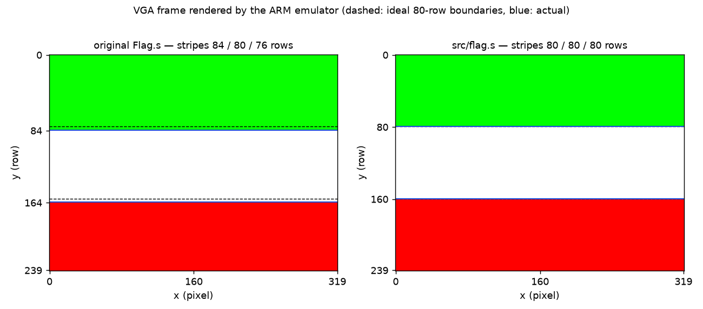

# ARM Assembly Flag Renderer

[](https://github.com/Shayan-Amz/ARM-Assembly-Flag-Renderer/actions/workflows/ci.yml)
[](src/flag.s)
[](https://cpulator.01xz.net/?sys=arm-de1soc)
[](LICENSE)

A bare-metal ARMv7 assembly program that draws the tricolour flag of Iran by writing RGB565 pixels
straight into the memory-mapped VGA pixel buffer of the **DE1-SoC Computer** (Intel FPGA University
Program), as simulated by [CPUlator](https://cpulator.01xz.net/). The repository also contains an
**emulator-based test harness** that runs the binary under Unicorn (QEMU's CPU core), renders the frame
to PNG and verifies the geometry, memory bounds and termination — turning a "looks right on screen"
lab exercise into something that is checked in CI.

<p align="center">
  
  <br>
  <sub>Frames rendered by <code>tools/emulate.py</code>. Left: the original course submission (stripes of 84 / 80 / 76 rows). Right: this version (80 / 80 / 80).</sub>
</p>

---

## Table of Contents

1. [Hardware model](#hardware-model)
2. [Program design](#program-design)
3. [What the original got wrong](#what-the-original-got-wrong)
4. [Building and running](#building-and-running)
5. [Verification](#verification)
6. [Project structure](#project-structure)
7. [Extending](#extending)
8. [References](#references)
9. [License](#license)

---

## Hardware model

The DE1-SoC Computer exposes its VGA frame as a **pixel buffer**: a region of memory that a DMA
controller continuously scans out to the display. Nothing has to be initialised — writing a halfword
puts a dot on the screen.

```
                31              10 9         1 0
                ┌─────────────────┬───────────┬─┐
  pixel (x, y)  │ 0xC8000000 base │  y        │x│      address = 0xC8000000 | y << 10 | x << 1
                └─────────────────┴───────────┴─┘

  resolution        320 × 240 visible pixels
  pixel format      16-bit RGB565:   R4 R3 R2 R1 R0 | G5 G4 G3 G2 G1 G0 | B4 B3 B2 B1 B0
  row stride        1024 bytes  (= 512 pixel slots; columns 320…511 are never displayed)
  frame size        240 rows × 1024 B = 240 KiB   →  0xC8000000 … 0xC803BFFF
  pixel memory      256 KiB              →  0xC8000000 … 0xC803FFFF  (writes beyond this hit nothing)
```

The `x << 1 | y << 10` layout is why the stride is 1024 and not 640: the hardware trades 38 % of
the memory for an address computation that is two shifts and an OR instead of a multiply.

Colours are RGB565, so 8-bit channels are converted with `R >> 3`, `G >> 2`, `B >> 3`:

| stripe | RGB565 | R | G | B |
|--------|--------|---|---|---|
| green  | `0x07E0` | 0 | 63 | 0 |
| white  | `0xFFFF` | 31 | 63 | 31 |
| red    | `0xF800` | 31 | 0 | 0 |

---

## Program design

[`src/flag.s`](src/flag.s) — 116 bytes of code and data, GNU `as` syntax (`.syntax unified`).

```
_start
  ├─ ldr sp, =STACK_TOP          a stack is required before any BL
  ├─ for each (colour, rows) in stripes:
  │     r0 = dst, r1 = colour, r2 = rows
  │     bl fill_rows             → r0 = address of the next row
  └─ halt:  b halt               bare metal has nowhere to return to

fill_rows (r0 dst, r1 colour, r2 rows) → r0
  orr  r1, r1, r1, lsl #16       pack two pixels per word
  for each row:
      160 ×  str r1, [r0], #4    320 visible pixels, post-indexed store
      add  r0, r0, #384          skip the invisible part of the row
  bx   lr

stripes:  .hword GREEN,80,  WHITE,80,  RED,80      (.rodata — edit this to draw another tricolour)
```

Design points worth noting:

* **Geometry from named constants.** `WIDTH`, `HEIGHT`, `STRIDE` and `HEIGHT / 3` are the only
  numbers; stripe boundaries are never written as raw addresses, so they cannot be off by a few rows.
* **A real subroutine.** `fill_rows` follows the ARM Procedure Call Standard (AAPCS): arguments in
  `r0–r2`, result in `r0`, only caller-saved scratch registers touched, return with `bx lr`. Being a
  leaf routine it needs no stack frame, but `_start` still sets `sp` so the convention holds if the
  routine ever grows.
* **Data-driven.** The stripe table lives in `.rodata`; the code does not know how many stripes
  there are or what colour they have.
* **Unsigned address compares.** Pixel-buffer addresses are above `0x80000000`, so a signed
  `blt` would treat them as negative; loops use `blo`/`bne` on `subs`.
* **Post-indexed stores** (`str r1, [r0], #4`) fold the pointer increment into the store,
  and `subs … bne` folds the loop counter test into the decrement — the inner loop is three
  instructions.
* **Explicit halt.** After the last stripe the program spins in `b halt`. Without it the CPU would
  run off the end of `.text` into the literal pool and execute data.

---

## What the original got wrong

The first version ([`legacy/Flag.s`](legacy/Flag.s), 44 lines) produced a flag that *looked* right,
which is exactly what makes it a useful case study. Running both binaries in the emulator
(`make run` / `make legacy`):

| metric | original `Flag.s` | `src/flag.s` |
|--------|------------------:|-------------:|
| stripe heights (rows) | **84 / 80 / 76** | 80 / 80 / 80 |
| stores outside the 240 KiB frame | **9 216** (up to `0xC8045000`) | 0 |
| stores into the invisible row padding | **46 080** (38 % of all pixel writes) | 0 |
| instructions executed | 353 286 | 116 201 |
| terminates cleanly | **no** — falls through into its literal pool | yes (`b halt`) |
| green value | `0x0FE0` (bit 11 is the LSB of *red*) | `0x07E0` |

The root cause of the first three rows is the same: the original expressed everything as byte
addresses (`0xC8015000`, `0xC8029000`, `0xC8045000`) chosen without reference to the 1024-byte row
stride or the 240-row height. `0xC8015000 / 1024 = 84`, so the green stripe is four rows too tall,
and `0xC8045000` is 36 KiB past the end of the frame. See [`legacy/README.md`](legacy/README.md) for
the full defect table.

---

## Building and running

### In CPUlator (no installation)

1. Open <https://cpulator.01xz.net/?sys=arm-de1soc>.
2. Paste [`src/flag.s`](src/flag.s) into the editor → **Compile and Load** → **Run** (F5).
3. The flag appears in the *VGA pixel buffer* device window; the CPU ends up spinning at `halt`.

### With a toolchain

The Makefile uses GNU `arm-none-eabi-{as,ld,objcopy}` when installed and otherwise falls back to
[`zig`](https://ziglang.org) (`pip install ziglang`), whose bundled clang/lld cross-assembles ARM
without any extra packages.

```bash
make                     # build/flag.elf, build/flag.bin (+ the legacy program)
pip install unicorn      # one-off: the emulator used by the test harness
make run                 # emulate, render build/flag.png, verify → PASS
make legacy              # same for the original program → FAIL (as documented above)
```

`build/flag.elf` can also be loaded into CPUlator directly (*File → Load executable*), and the
flat `flag.bin` is what a boot ROM would copy to address 0.

---

## Verification

[`tools/emulate.py`](tools/emulate.py) builds a minimal machine model — SDRAM at 0 and the pixel-buffer
memory at `0xC8000000` — executes the binary with [Unicorn](https://www.unicorn-engine.org/), and
checks:

* **geometry** — every row is uniformly coloured and the stripe run-lengths are exactly `80,80,80`;
* **memory safety** — no store lands beyond the end of the frame, and stores into the invisible
  row padding are counted;
* **termination** — the program reaches a branch-to-self halt loop rather than executing data or
  exhausting the instruction budget;
* **cost** — the instruction count is reported (a proxy for cycles on this simple in-order core).

The rendered frame is saved as PNG (`docs/figures/flag.png` is the committed output). GitHub Actions
assembles the program with **both** toolchains on every push, runs the harness, and uploads the
rendered frame as a build artifact.

---

## Project structure

```
.
├── src/
│   ├── flag.s            the program (documented above)
│   └── link.ld           bare-metal link script: .text at 0x00000000 (reset vector), then .rodata
├── legacy/
│   ├── Flag.s            original course submission, unchanged
│   └── README.md         defect table
├── tools/emulate.py      Unicorn-based emulator, PNG renderer and checker
├── docs/figures/         flag.png (rendered output), before_after.png
├── Makefile              gnu / zig toolchain selection, run / legacy / figures targets
├── .github/workflows/ci.yml
└── LICENSE (MIT)
```

---

## Extending

* **Another tricolour** — edit the three `.hword` pairs in `stripes`; the rows need not be equal.
* **Vertical stripes** — write a `fill_columns` sibling of `fill_rows` that steps by `STRIDE`
  in the inner loop and by 2 in the outer one.
* **The emblem** — the centre of the Iranian flag carries an emblem and the Kufic *takbīr* along the
  stripe borders; a 1-bit sprite blitted with `ldrb`/`strh` from a `.rodata` bitmap would add it.
* **Double buffering** — the pixel-buffer DMA controller at `0xFF203020` supports page flipping
  (write the back-buffer address, then write to the *buffer* register to swap on the next vsync);
  drawing off-screen and flipping removes tearing for animated content.

---

## References

1. Intel FPGA University Program, *DE1-SoC Computer System with ARM Cortex-A9* — pixel-buffer
   layout, VGA controller registers and memory map.
2. Arm Ltd., *Procedure Call Standard for the Arm Architecture (AAPCS32)* — register usage and
   calling convention followed by `fill_rows`.
3. Arm Ltd., *ARM Architecture Reference Manual, ARMv7-A and ARMv7-R edition* — instruction semantics
   (post-indexed addressing, condition codes, `subs`/`bne` idiom).
4. H. Wong, [CPUlator Computer System Simulator](https://cpulator.01xz.net/doc/) — the simulator
   used in the course; its debug assertions flag the "executing data" fault of the original program.
5. Unicorn Engine — N. A. Quynh, D. H. Vu, "Unicorn: Next Generation CPU Emulator Framework",
   Black Hat USA 2015.

---

## License

Released under the [MIT License](LICENSE).
